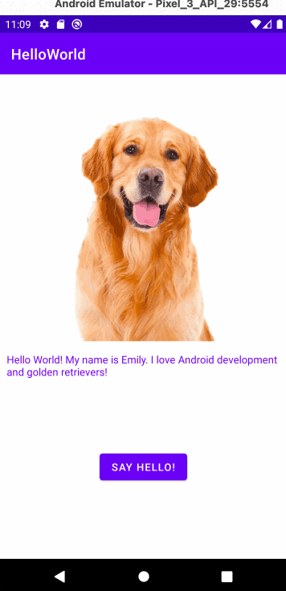

# Android Prework - *HelloWorld App*

Submitted by: **Sahiti Hibane**

**HelloWorld App** is an android app that shows an image and introductory message, and allows pressing a button to display a Toast. 

Time spent: **3** hours spent in total

## Required Features

The following **required** functionality is completed:

* [x] Image and introductory message displayed on screen
* [x] Button displayed on screen
* [x] Toast with message appears when button is pressed 

The following **optional** features are implemented:

* [x] Improve the app's UI with matching font color for introductory message.

## Video Walkthrough

Here's a walkthrough of implemented features:

GIF created with LICEcap  

## Notes

Making sure the image and the introductory message align together in a proper way i.e. centered properly one below the other was a bit of a challenge in the beginning. Yet, I was able to figure it out as I tried different alignments for them to match up well.

## License

    Copyright 2022 Sahiti Hibane

    Licensed under the Apache License, Version 2.0 (the "License");
    you may not use this file except in compliance with the License.
    You may obtain a copy of the License at

        http://www.apache.org/licenses/LICENSE-2.0

    Unless required by applicable law or agreed to in writing, software
    distributed under the License is distributed on an "AS IS" BASIS,
    WITHOUT WARRANTIES OR CONDITIONS OF ANY KIND, either express or implied.
    See the License for the specific language governing permissions and
    limitations under the License.
